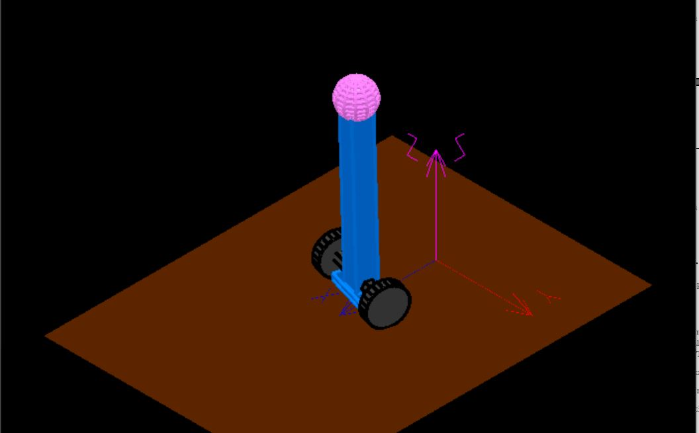

# 3D Segway Tracking Control

## Description
* Simulated the motion of a segway in 3D space using a multibody approach.
* Designed a LQR controller to control the motion of the simulated segway.

## Dependencies
* [EasyDyn Installation and Steps](https://www.youtube.com/watch?v=UBJsEpGhe54&list=PLHqhOPWK5Yj9mU4LEKnrzOPH6ZNaJ5KxG) 

## Usage
* Use the DesignController.m file to design a controller according to your desired performance.
* Open and Run the segway.cpp file
* Use EasyAnim to View the animation or to view the mode shapes.
* Use GnuPlot to view the motion plots and their derivatives 

Note: Do not run the python file, it will erase important information in the c++ file.
The python file is just used to generate the kinematics

## Author
* Jonas Chianu